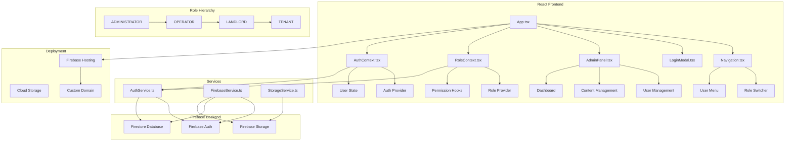
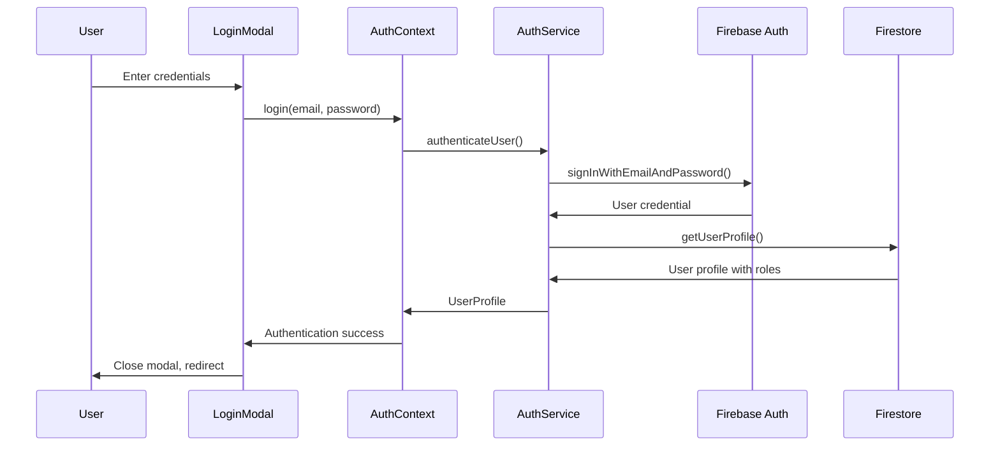
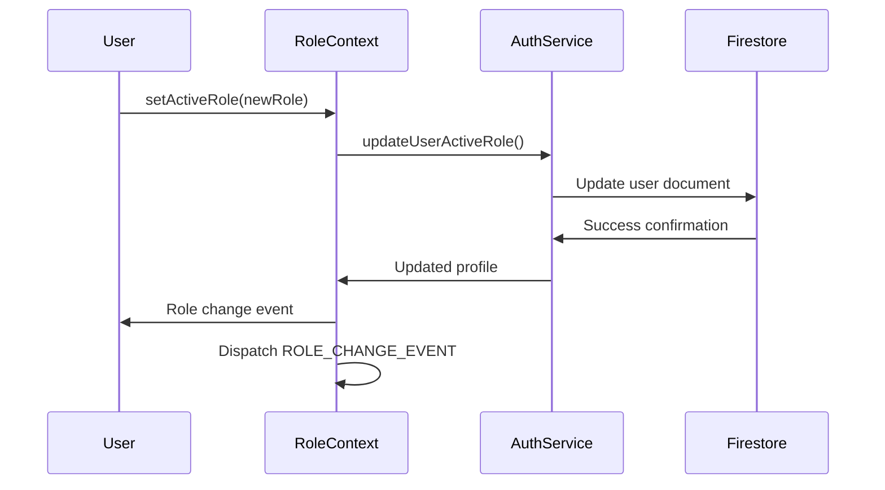

# LetzPocket Admin System - Architecture Overview

## System Architecture Diagram



## Component Architecture

### 1. Core Application Structure

#### **App.tsx (Main Application)**
- **Purpose:** Root component managing routing and global state
- **Key Features:**
  - Route management based on user roles
  - Event-driven role switching
  - Global error handling
  - Authentication state management

#### **Navigation.tsx (Main Navigation)**
- **Purpose:** Primary navigation with role-based menu items
- **Key Features:**
  - Role switcher dropdown for multi-role users
  - Dynamic menu based on active role
  - Mobile-responsive design
  - User authentication status

#### **LoginModal.tsx (Authentication)**
- **Purpose:** User authentication interface
- **Key Features:**
  - Email/password authentication
  - User registration with role selection
  - Form validation and error handling
  - Modal state management

### 2. Context Management

#### **AuthContext.tsx (Authentication Context)**
- **Purpose:** Global authentication state management
- **Key Features:**
  - User authentication state
  - Login/logout functionality
  - User profile management
  - Authentication error handling

#### **RoleContext.tsx (Role Management Context)**
- **Purpose:** Role-based access control and permissions
- **Key Features:**
  - Active role management
  - Permission checking hooks
  - Role hierarchy enforcement
  - Role change event dispatching

### 3. Administrative Interface

#### **AdminPanel.tsx (Admin Dashboard)**
- **Purpose:** Main administrative interface
- **Key Features:**
  - User management and search
  - Content management system
  - Role assignment and updates
  - Administrative dashboard

### 4. Service Layer

#### **AuthService.ts (Authentication Service)**
- **Purpose:** Firebase authentication operations
- **Key Features:**
  - User registration and login
  - Profile creation and management
  - Role assignment logic
  - Password management

#### **FirebaseService.ts (Firebase Integration)**
- **Purpose:** Firebase backend integration
- **Key Features:**
  - Firestore database operations
  - Real-time data synchronization
  - Firebase configuration management

## Data Flow Architecture

### User Authentication Flow


### Role Management Flow


## Database Schema

### Firestore Collections

#### **users Collection**
```typescript
interface UserProfile {
  uid: string;           // Firebase Auth UID
  email: string;         // User email
  firstName: string;     // First name
  lastName: string;      // Last name
  phone?: string;        // Phone number
  company?: string;      // Company name
  roles: UserRole[];     // Array of user roles
  activeRole: UserRole;  // Currently active role
  createdAt: Timestamp;  // Account creation date
  lastLogin: Timestamp;  // Last login timestamp
  isEmailVerified: boolean; // Email verification status
}
```

#### **content Collection**
```typescript
interface ContentItem {
  id: string;           // Document ID
  type: string;          // Content type (landing, terms, etc.)
  title: string;         // Content title
  content: string;       // HTML/Text content
  lastModified: Timestamp; // Last modification date
  modifiedBy: string;    // UID of modifier
  isActive: boolean;     // Content status
}
```

## Role-Based Access Control

### Role Hierarchy
1. **ADMINISTRATOR** - Full system access
   - User management
   - Content management
   - System configuration
   - All lower-level permissions

2. **OPERATOR** - Operational access
   - Content management
   - User viewing
   - Limited administrative functions
   - All lower-level permissions

3. **LANDLORD** - Property management access
   - Property management features
   - Tenant management
   - Reporting and analytics
   - All lower-level permissions

4. **TENANT** - Basic user access
   - Profile management
   - Basic viewing permissions

### Permission System
```typescript
interface Permission {
  resource: string;     // Resource identifier
  action: string;        // Action type (read, write, delete)
  roles: UserRole[];    // Roles that have this permission
}
```

## Security Architecture

### Authentication Security
- Firebase Authentication with email/password
- Email verification required
- Session management with Firebase tokens
- Automatic token refresh

### Authorization Security
- Role-based access control (RBAC)
- Permission checking at component level
- Route protection based on roles
- API endpoint protection

### Data Security
- Firestore security rules
- Input validation and sanitization
- XSS protection
- CSRF protection

## Deployment Architecture

### Production Environment
- **Hosting:** Firebase Hosting
- **Domain:** https://letzpocket-site.web.app
- **Database:** Firestore (Production mode)
- **Authentication:** Firebase Auth (Production)
- **Storage:** Firebase Storage

### Development Environment
- **Local Development:** React Development Server
- **Dev Tools:** Protected development utilities
- **Environment Detection:** Development-only features
- **Hot Reloading:** Development build optimizations

## Performance Optimizations

### Frontend Optimizations
- Code splitting and lazy loading
- Component memoization
- Optimized re-renders
- Bundle size optimization

### Backend Optimizations
- Firestore query optimization
- Indexed database queries
- Caching strategies
- Real-time updates only when needed

## Future Scalability Considerations

### Horizontal Scaling
- Serverless architecture with Firebase
- Auto-scaling capabilities
- Global CDN distribution
- Load balancing

### Feature Extensibility
- Modular component architecture
- Plugin-based feature system
- API-first design
- Microservices potential

## Technology Stack

### Frontend
- **Framework:** React 19.2.4
- **Language:** TypeScript
- **Styling:** Tailwind CSS
- **UI Components:** Custom components with Radix UI
- **State Management:** React Context API
- **Build Tool:** Create React App

### Backend
- **Authentication:** Firebase Auth
- **Database:** Firestore
- **Storage:** Firebase Storage
- **Hosting:** Firebase Hosting

### Development Tools
- **Package Manager:** npm
- **Linting:** ESLint
- **Code Formatting:** Prettier
- **Version Control:** Git
- **Deployment:** Firebase CLI

---

*This architecture document provides a comprehensive overview of the LetzPocket admin system, designed for scalability, security, and maintainability.*
